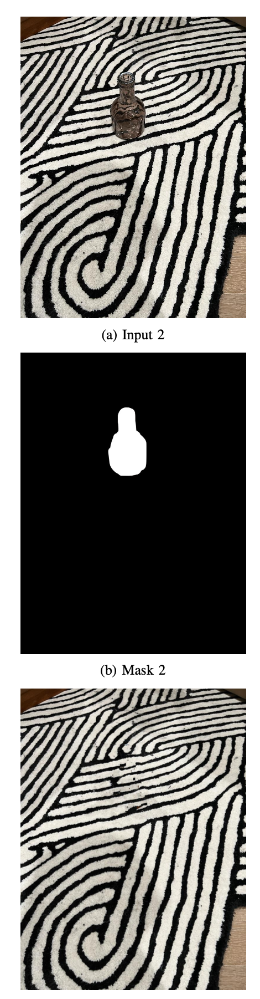
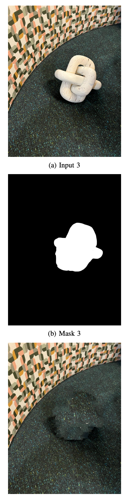

# Object Removal by Exemplar-based Image Inpainting

The scope of the project was to create a successful recreation of the object removal algorithm represented in the following paper:

- Criminisi, A., Perez, P., & Toyama, K. (2004). [Region Filling and Object Removal by Exemplar-Based Image Inpainting](https://www.microsoft.com/en-us/research/wp-content/uploads/2016/02/criminisi_tip2004.pdf). *IEEE Transactions on Image Processing*, 13(9). 

 The aim was to enable this using vectorised code to achieve close to real-time processing time. The results expected are that of a a complete object removal with reasonably well in-painting features.

 Object removal remains a growing area with many new methods and papers emerging every year. Google's Magic Eraser is a good example of an object removal tool found on mobile devices! The research paper covered in this project is much simpler, but at the time it was written, it helped to generate several improvements in the object removal process.

Replication provides a deeper understanding of the research process and results. While previous results are helpful as a guide towards implementation, successful replication is challenging. The instructions from the published paper are not always clear and implementation details may be missing or ambiguous, which makes it difficult or impossible to achieve exactly the same results.

## Results 
The following are few results from the implementation of the code provided in this repository. The reuslts are from complex non-geometric environments.
 

